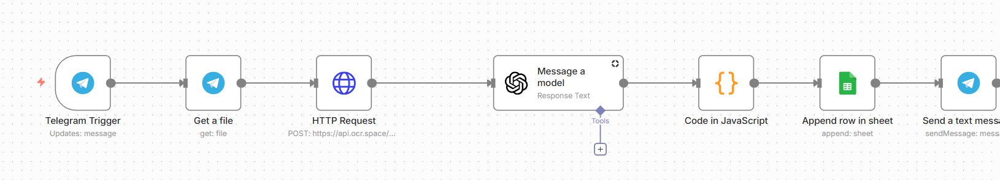

# invoice-processing-automation-n8n
# 📄 Automated Invoice Processing with n8n & OpenAI

🚀 **End-to-end automation for invoice processing**, designed to reduce manual work and eliminate human errors in administrative workflows.

This project demonstrates how automation and AI can be combined to solve a real-world business problem using no-code tools and modern APIs.

## 🧱 Architecture

---

## 🧩 What does this project do?

✅ Receives invoice images via a Telegram bot  
✅ Extracts raw text using OCR  
✅ Converts unstructured text into structured JSON using OpenAI  
✅ Normalizes invoice data  
✅ Stores results automatically in Google Sheets  
✅ Sends a confirmation message back to the user  

All steps run automatically, from input to storage.

---

## 🛠️ Technologies Used

- ⚙️ **n8n** – Workflow automation  
- 💬 **Telegram Bot API** – Invoice input  
- 🖼️ **OCR Service** – Text extraction  
- 🧠 **OpenAI API** – Data structuring and understanding  
- 📊 **Google Sheets** – Data storage  

---

## 📦 Example Output

Each invoice is transformed into structured data with fields such as:

- 🏢 Supplier  
- 📅 Invoice date  
- 🧾 Invoice number  
- 💰 Total amount  
- 💱 Currency  
- 🏷️ Category  

---

## 🎥 Demo

📽️ A short demo video showing the full workflow execution:  
👉 https://www.linkedin.com/posts/pablo-p%C3%A9rez-holgado_automatizaciaejn-n8n-apis-activity-7407386136567873536-Qga8?utm_source=share&utm_medium=member_desktop&rcm=ACoAAFVEto0ByVjBxdNJWsTKOpRT2h6EFXqDdVk

---

## 🎯 Project Purpose

This project was created as a **portfolio project** to showcase practical skills in:

- Automation design  
- API integration  
- Data processing  
- AI-assisted document understanding  

It reflects a real-world use case applicable to administrative and business environments.

---

## 👤 Author

Developed by Pablo Pérez Holgado
